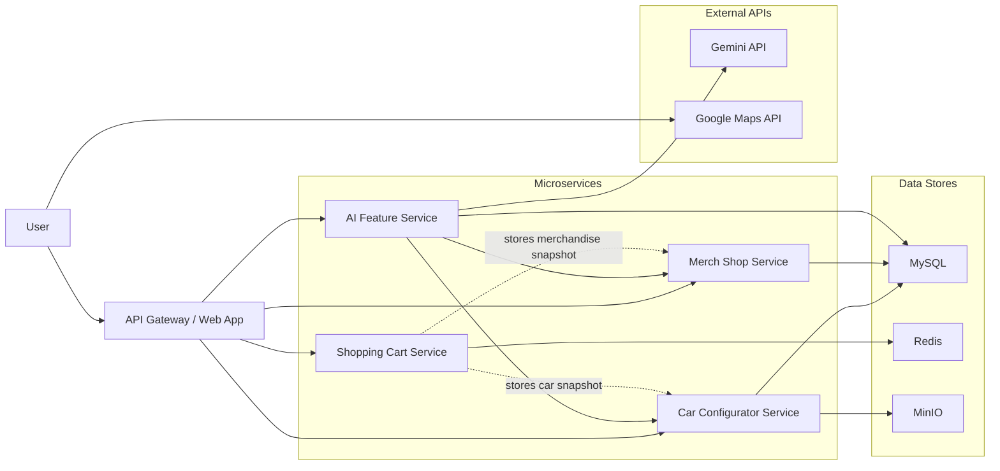

# System Architecture

## 1. Purpose

This document describes the high-level architecture of the BMW cloud web app course project. It summarizes the agreed system boundaries, service responsibilities, main data flow, and infrastructure dependencies.

The system is designed around one gateway-style web application with multiple backend microservices. The first version is optimized for local Docker-based development and demonstration, while still keeping service ownership clear.

For product-level expected behavior, refer to `docs/PRD.md`. This architecture document focuses on responsibility boundaries and request/data flow rather than delivery status.

## 2. Architecture Diagram

The Mermaid source is also stored separately in `docs/diagrams/architecture.mmd`.

## 3. Architecture Overview

The architecture follows a simple microservice structure:

- one gateway-style web application for user interaction and page rendering
- four backend domain services
- one relational database for persistent business data
- one cache store for cart state
- one object storage service for configurator images
- one backend AI integration (Gemini API via `ai-feature` service)
- one client-side map integration (Google Maps JavaScript API loaded in the browser)

The API gateway is the single entry point for the user. Business truth remains in the backend services.

## 4. Main Components

### 4.1 API Gateway / Web App

The `api-gateway` directory provides one user-facing application that combines:

- car configuration
- merchandise browsing
- route planning
- AI recommendation
- unified cart display

Its role is to:

- serve the UI pages
- collect browser requests
- call backend services
- serve internal product-owned support data such as the predefined route destination list
It should not own configuration validity, official pricing, or cart persistence rules.

### 4.2 Configurator Service

The configurator service is the source of truth for car configuration results.

Its responsibilities are:

- support two car models; the user selects a model first, then configures options within that model
- receive model and selected parameters, validate the combination
- look up the image key in MySQL for the matching combination, then retrieve the image from MinIO
- calculate final price in the backend
- return structured metadata such as advantages, disadvantages, and recommendation labels

The service does not generate images. It looks up a pre-uploaded image object in MinIO using the key stored in MySQL for the given combination.

### 4.3 Merch Shop Service

The merch shop service provides product information for the merchandise page.

Its responsibilities are:

- return product list and detail information
- read merchandise data from MySQL
- support cart addition and display use cases
- provide stable product identifiers suitable for direct linking from AI recommendations and the web application

### 4.4 Route Planning (client-side)

There is no standalone road service. Route planning runs entirely in the browser using the Google Maps JavaScript API.

- the `api-gateway` injects the Maps API key server-side into the EJS template
- the browser loads Maps JS API and uses `DirectionsService` + `DirectionsRenderer` for route calculation and map rendering
- the `api-gateway` backend holds a hardcoded list of store and showroom destinations, returned to the frontend on request
- no backend call is made to Google Maps at runtime

### 4.5 AI Feature Service

The AI feature service is a global shopping assistant accessible from any page. It handles both car configuration recommendations and merchandise recommendations.

Its responsibilities are:

- accept user natural-language prompts
- fetch relevant context: configuration options (both models) and merchandise catalog
- send structured context and a stable prompt/template to Gemini
- receive structured recommendation output and rationale from Gemini
- call `configurator` to resolve the official car configuration result
- return recommendations as links: a link to the configurator page pre-filled with recommended options, and structured merch recommendation items with title, thumbnail URL, and reason data

This service does not own official pricing or image truth. Those remain in the configurator service.

### 4.6 Shopping Cart Service

The cart service manages the unified cart.

Its responsibilities are:

- store cart state in Redis
- aggregate both car configurations and merchandise items
- store displayable snapshots rather than only raw identifiers
- support quantity changes for merchandise items as part of standard cart editing

For car items, the cart should persist enough snapshot data to show the selected result without requiring a fresh configurator lookup for every render.

## 5. Data Stores

### 5.1 MySQL

MySQL stores persistent business data.

Expected data domains include:

- configuration option definitions
- option values
- valid configuration combinations
- combination image paths or URLs
- pricing information
- rationale metadata
- merchandise catalog data

The first version uses a table-driven lookup model instead of a complex rules engine.

### 5.2 Redis

Redis stores shopping cart state.

It is used because the cart is session-oriented and needs low-latency updates for:

- add item
- remove item
- update quantity
- display current cart content

### 5.3 MinIO

MinIO stores pre-generated configurator images.

It is used because:

- configurator images are binary assets rather than relational records
- the configurator service can return stable object URLs or object keys
- it matches the intended object-storage pattern better than storing image files directly in the service codebase

## 6. External Integrations

### 6.1 Gemini API

Gemini is used only by the AI feature service.

Its role is to:

- interpret natural-language user intent
- recommend structured configuration parameters
- generate recommendation rationale and trade-off explanations
- emit structured merch recommendation items for the frontend recommendation panel

### 6.2 Google Maps JavaScript API

The Maps JS API is loaded client-side in the browser. The API key is injected into the EJS template by `api-gateway` at render time and restricted by HTTP referrer in Google Cloud Console.

Its role is to:

- render an interactive map in the browser
- calculate routes from the user's current location to a selected store destination via `DirectionsService`
- display the route on the map via `DirectionsRenderer`

## 7. Main Request Flows

### 7.1 Standard Configurator Flow

1. the user selects configuration options in the frontend
2. the frontend calls the configurator service
3. the configurator service validates the selection
4. the configurator service resolves the image and price
5. the frontend displays the official result

### 7.2 AI Recommendation Flow

1. the user enters a natural-language request
2. the frontend calls the AI feature service
3. the AI feature service reads relevant context
4. the AI feature service calls Gemini
5. Gemini returns structured recommendation output and rationale
6. the AI feature service calls the configurator service
7. the configurator service returns the official configuration result
8. the frontend shows the recommended configuration and merch recommendation panel

### 7.3 Cart Flow

1. the frontend sends a selected car configuration or merchandise item to the cart service
2. the cart service stores a snapshot in Redis
3. the frontend may update merchandise quantity through the cart service
4. the frontend reads the aggregated cart from the cart service

### 7.4 Route Planning Flow

1. the user opens the route planning page; the browser loads Maps JS API (key injected by `api-gateway`)
2. the frontend fetches the destination list from `api-gateway`
3. the user selects a destination; the browser calls `DirectionsService` directly
4. `DirectionsRenderer` draws the route on the map in the browser

## 8. Key Design Decisions

The architecture reflects the following agreed decisions:

- one unified web app is used instead of multiple frontend applications
- the repository currently uses an `api-gateway` directory as the web entry point
- the configurator uses pre-generated images instead of live rendering
- pre-generated configurator images are stored in MinIO
- backend services own business truth
- configuration pricing is calculated in the backend
- AI recommendation is implemented through a service-to-service flow, not a direct frontend-to-Gemini shortcut
- AI recommendation should use a stable prompt/template plus structured output contract
- cart stores snapshots for display stability
- route planning runs client-side via Maps JS API; the key is injected by `api-gateway` and destination list is served by `api-gateway`

## 9. First-Version Constraints

To keep the course project deliverable realistic, the first version intentionally stays simple:

- no authentication system
- no production order flow
- no live rendering engine
- no complex pricing rule engine
- no arbitrary destination search requirement

These constraints reduce implementation cost while preserving architectural clarity.
