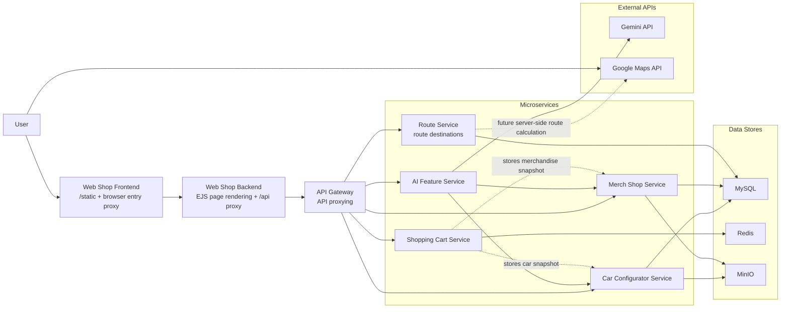

# System Architecture

## 1. Purpose

This document describes the high-level architecture of the BMW cloud web app course project. It summarizes the agreed system boundaries, service responsibilities, main data flow, and infrastructure dependencies.

The system is designed around a split web-shop presentation layer, one API gateway, and multiple backend microservices. The first version is optimized for local Docker-based development and demonstration, while still keeping service ownership clear.

For product-level expected behavior, refer to `docs/PRD.md`. This architecture document focuses on responsibility boundaries and request/data flow rather than delivery status.

## 2. Architecture Diagram

```mermaid
flowchart LR
    user["User"]
    frontend["Web Shop Frontend\n/static + browser entry proxy"]
    backendPresentation["Web Shop Backend\nEJS page rendering + /api proxy"]
    gateway["API Gateway\nAPI proxying"]

    subgraph backend["Microservices"]
        configurator["Car Configurator Service"]
        merchandise["Merch Shop Service"]
        ai["AI Feature Service"]
        cart["Shopping Cart Service"]
        route["Route Service\nroute destinations"]
    end

    subgraph data["Data Stores"]
        mysql["MySQL"]
        redis["Redis"]
        minio["MinIO"]
    end

    subgraph external["External APIs"]
        gemini["Gemini API"]
        googlemaps["Google Maps API"]
    end

    user --> frontend
    frontend --> backendPresentation
    backendPresentation --> gateway

    gateway --> configurator
    gateway --> merchandise
    gateway --> ai
    gateway --> cart
    gateway --> route

    user --> googlemaps

    configurator --> mysql
    configurator --> minio

    merchandise --> mysql
    merchandise --> minio

    ai --> gemini
    ai --> configurator
    ai --> merchandise

    cart --> redis
    route --> mysql

    route -. "future server-side route calculation" .-> googlemaps

    cart -. "stores car snapshot" .-> configurator
    cart -. "stores merchandise snapshot" .-> merchandise
```

The Mermaid source is also stored separately in `docs/diagrams/architecture.mmd`.

## 3. Architecture Overview

The architecture follows a simple microservice structure:

- one browser-facing web-shop frontend for `/static`, `/health`, and request forwarding
- one web-shop backend for EJS page rendering and same-origin API forwarding
- one API gateway for API request forwarding
- five backend domain services
- one relational database for persistent business data
- one cache store for cart state
- one object storage service for configurator images
- one backend AI integration through the `ai-feature` service
- one client-side map integration through the Google Maps JavaScript API

The web-shop frontend is the only browser-facing application container in local development. It serves shared static assets and forwards page/API requests to the web-shop backend. Browser API calls use same-origin `/api/*` routes, which pass through the web-shop backend to the API gateway. Business truth remains in the backend services.

## 4. Main Components

### 4.1 Web Shop Frontend

The `services/web-shop-frontend` service provides the browser-facing entry point.

Its responsibilities are:

- serve static assets for the web experience under `/static`
- expose the application host port (`localhost:3000`) in Docker Compose
- provide a lightweight `/health` endpoint for the browser-facing container
- forward all non-static browser requests to `web-shop-backend`

It does not render EJS pages and does not call domain microservices directly.

### 4.2 Web Shop Backend

The `services/web-shop-backend` service provides server-side rendering and browser request mediation behind the frontend proxy.

Its responsibilities are:

- render the EJS pages for Home, Configurator, Merch Shop, AI Feature, Shopping Cart, and Impressum
- keep existing page routes stable for the browser
- forward same-origin `/api/*` requests to the API gateway
- fetch merch list/detail data for SSR through the API gateway at `/api/merch/products` and `/api/merch/products/:productId`
- mediate same-origin API asset requests through the gateway instead of exposing a presentation-tier MinIO proxy

The web-shop backend does not own configuration validity, official pricing, AI recommendation logic, cart persistence rules, or merch catalog truth. It has no direct `MERCH_URL` dependency.

The Home page is part of this presentation layer. It is not a microservice because it is a browser-facing page rendered by `web-shop-backend`, not an independently deployable backend capability with its own business rules or data ownership.

### 4.3 API Gateway

The `api-gateway` service provides the API-facing entry point for the frontend.

Its responsibilities are:

- proxy API requests to backend services
- maintain the session cookie used for cart tracking

It intentionally does not render EJS pages and does not serve static assets.

### 4.4 Configurator Service

The configurator service is the source of truth for car configuration results.

Its responsibilities are:

- support two car models; the user selects a model first, then configures options within that model
- receive model and selected parameters, validate the combination
- look up the image key in MySQL for the matching combination, then retrieve the image from MinIO
- calculate final price in the backend
- return structured metadata such as advantages, disadvantages, and recommendation labels

The service does not generate images. It looks up a pre-uploaded image object in MinIO using the key stored in MySQL for the given combination.

### 4.5 Merch Shop Service

The merch shop service provides product information for the merchandise page.

Its responsibilities are:

- return product list and detail information
- read merchandise data from MySQL
- resolve merchandise image URLs from MinIO-backed object keys
- support cart addition and display use cases
- provide stable product identifiers suitable for direct linking from AI recommendations and the web application

### 4.6 Route Service And Route Planning

The `route-service` owns route-planning support data in the `bmw_route_service` MySQL schema and is the designated service boundary for future route-domain behavior.

Its current responsibilities are:

- return predefined BMW route destinations through `GET /destinations`
- keep destination data out of the API gateway and presentation layer
- read predefined active destinations from its own `destinations` table
- provide the future owner for server-side route calculation, route history, ETA policy, service-area rules, and map-provider abstraction

In the current scope, route calculation and map rendering still run in the browser through Google Maps JavaScript API. The `web-shop-backend` injects the browser API key into the EJS template, the browser loads Maps JS API, and the browser uses `DirectionsService` and `DirectionsRenderer`.

The API gateway exposes `GET /api/destinations` and proxies it to `route-service`. The gateway does not own destination data and does not connect to MySQL.

### 4.7 AI Feature Service

The AI feature service is a global shopping assistant accessible from any page. It handles both car configuration recommendations and merchandise recommendations.

Its responsibilities are:

- accept user natural-language prompts
- fetch relevant context through service APIs: configuration options from `car-configurator` and merchandise catalog data from `merch-shop`
- send structured context and a stable prompt/template to Gemini
- receive structured recommendation output and rationale from Gemini
- use configurator APIs, not direct SQL, whenever car configuration data or official validation is needed
- return recommendations as links and structured merchandise recommendation items

This service is an integration/orchestration service. It does not own a database schema, connect to MySQL, or query another service's tables directly. If AI needs additional domain data, the owning service must expose it through a service endpoint. Official pricing, configuration validity, and image truth remain in the configurator service; merchandise catalog truth remains in the merch shop service.

This boundary also protects `ai-feature` from a future split from one shared database into service-owned databases. Database names, schemas, credentials, containers, and migration strategy are internal details of `car-configurator` and `merch-shop`. `ai-feature` depends on their HTTP API contracts; it should only need changes if those endpoint URLs, response fields, response semantics, or service availability change.

### 4.8 Shopping Cart Service

The cart service manages the unified cart.

Its responsibilities are:

- store cart state in Redis
- aggregate both car configurations and merchandise items
- store displayable snapshots rather than only raw identifiers
- support quantity changes for merchandise items as part of standard cart editing

For car items, the cart should persist enough snapshot data to show the selected result without requiring a fresh configurator lookup for every render.

## 5. Data Stores

### 5.1 MySQL

MySQL stores persistent business data:

- configuration option definitions
- option values
- valid configuration combinations
- combination image paths or URLs
- pricing information
- rationale metadata
- merchandise catalog data
- predefined BMW route destinations

The first version uses a table-driven lookup model instead of a complex rules engine. MySQL is accessed by the domain services that own the data, currently `car-configurator`, `merch-shop`, and `route-service`. If those services later move to separate service-owned databases, the database topology remains hidden behind their APIs. The `ai-feature` service has no direct database dependency and consumes domain data only through those service APIs.

### 5.2 Redis

Redis stores shopping cart state. It is used because the cart is session-oriented and needs low-latency updates for add, remove, quantity update, and display operations.

### 5.3 MinIO

MinIO stores pre-generated configurator and merchandise images. It is used because these images are binary assets rather than relational records. Browser-visible product image delivery is owned by the services that own the image references.

Phase 2 keeps the image objects in MinIO, but removes presentation-tier direct access to MinIO. Browser-visible image requests must flow through the application and service boundary:

`Browser -> web-shop-frontend -> web-shop-backend -> api-gateway -> owning service -> MinIO`

The implemented Phase 2 route contracts are:

- `GET /api/configurator/assets/*` for configurator-owned images
- `GET /api/merch/assets/*` for merchandise-owned images

`car-configurator` and `merch-shop` own the MinIO reads for their image prefixes and stream image responses back through the gateway. The gateway uses a binary/streaming proxy path for these routes, preserving response status, `content-type`, cache headers where present, and response body. The legacy browser-facing `/minio/*` URL contract is removed, not kept as a compatibility redirect.

### 5.4 Database Ownership

- `car-configurator` owns the schema `bmw_car_configurator` (models, options, configurations, prices, image keys).
- `merch-shop` owns the schema `bmw_merch_shop` (merchandise products).
- `route-service` owns the schema `bmw_route_service` (predefined BMW route destinations).
- Both schema names are fixed architecture constants and must not be configured via environment variables.
- Services must not query tables owned by other services directly.
- Local development may still run one shared MySQL instance in Docker Compose, but ownership is enforced logically by separate schemas with fixed names.

## 6. External Integrations

### 6.1 Gemini API

Gemini is used only by the AI feature service.

Its role is to:

- interpret natural-language user intent
- recommend structured configuration parameters
- generate recommendation rationale and trade-off explanations
- emit structured merchandise recommendation items for the frontend recommendation panel

### 6.2 Google Maps JavaScript API

The Maps JS API is loaded client-side in the browser. The API key is injected into the EJS template by `web-shop-backend` at render time and restricted by HTTP referrer in Google Cloud Console.

Its role is to:

- render an interactive map in the browser
- calculate routes from the user's current location to a selected store destination via `DirectionsService`
- display the route on the map via `DirectionsRenderer`

## 7. Main Request Flows

### 7.1 Standard Configurator Flow

1. the user selects configuration options in the browser
2. the browser calls `/api/configurator/...` on `web-shop-frontend`
3. `web-shop-frontend` forwards to `web-shop-backend`
4. `web-shop-backend` forwards to the API gateway
5. the API gateway forwards the request to the configurator service
4. the configurator service validates the selection
5. the configurator service resolves the image and price
6. the frontend displays the official result

### 7.2 AI Recommendation Flow

1. the user enters a natural-language request
2. the frontend calls `/api/ai/recommend`
3. the API gateway forwards the request to the AI feature service
4. the AI feature service reads relevant context
5. the AI feature service calls Gemini
6. Gemini returns structured recommendation output and rationale
7. the AI feature service maps the structured output to supported configurator and merch targets
8. the frontend opens the recommended configuration or merch product through the normal web/API flows

### 7.3 Cart Flow

1. the frontend sends a selected car configuration or merchandise item to `/api/cart/...`
2. the API gateway forwards the request to the cart service
3. the cart service stores a snapshot in Redis
4. the frontend may update merchandise quantity through the cart API
5. the frontend reads the aggregated cart through the cart API

### 7.4 Route Planning Flow

1. the user opens the route planning page through `web-shop-frontend`; the browser loads Maps JS API with the key injected by `web-shop-backend`
2. the browser fetches `/api/destinations` through `web-shop-frontend`
3. `web-shop-backend` forwards the request to `api-gateway`
4. `api-gateway` proxies the request to `route-service`
5. `route-service` reads active predefined BMW destinations from `bmw_route_service.destinations`
6. `route-service` returns predefined BMW destinations
7. the user selects a destination; the browser calls Google Maps `DirectionsService` directly
8. `DirectionsRenderer` draws the route on the map in the browser

## 8. Key Design Decisions

The architecture reflects the following agreed decisions:

- one unified browser entry is used instead of multiple frontend applications
- static asset serving and SSR are split between `services/web-shop-frontend` and `services/web-shop-backend`
- `api-gateway` is kept focused on API proxying and request forwarding
- the configurator uses pre-generated images instead of live rendering
- pre-generated images are stored in MinIO
- backend services own business truth
- AI is an orchestration service with no database ownership; it uses configurator and merch APIs for domain data
- configuration pricing is calculated in the backend
- AI recommendation is implemented through a service-to-service flow, not a direct frontend-to-Gemini shortcut
- AI recommendation should use a stable prompt/template plus structured output contract
- cart stores snapshots for display stability
- route planning runs client-side via Maps JS API; Google Maps owns current route calculation, while `route-service` owns predefined destination data and future route-domain behavior
- Phase 2 keeps images in MinIO, but only the owning domain services may read MinIO objects for browser-visible image delivery
- Phase 2 removes the MinIO API host port `9000`; the MinIO console port `9001` may remain host-exposed for local infrastructure/debug access
- Phase 2 deletes the legacy `/minio/*` URL contract and validates all browser image paths through `/api/configurator/assets/*` or `/api/merch/assets/*`

## 9. First-Version Constraints

To keep the course project deliverable realistic, the first version intentionally stays simple:

- no authentication system
- no production order flow
- no live rendering engine
- no complex pricing rule engine
- no arbitrary destination search requirement
- no dedicated Nginx or edge proxy container in the first version

These constraints reduce implementation cost while preserving architectural clarity.
