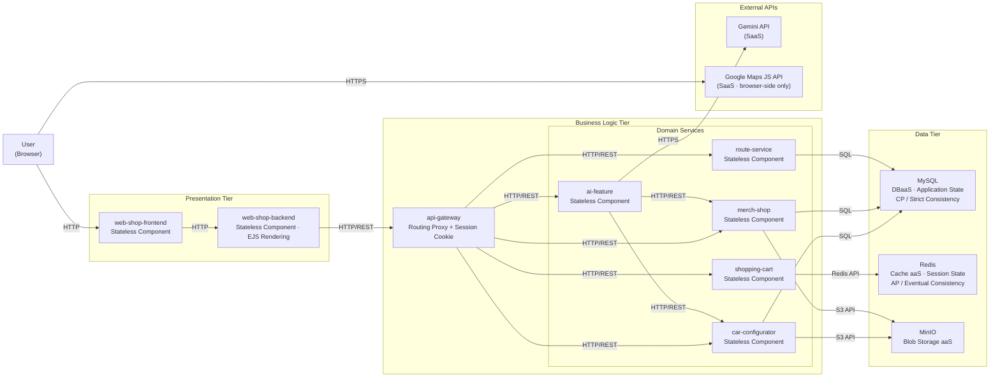

# System Architecture

## 1. Purpose

This document describes the high-level architecture of the BMW cloud web app course project. It summarises the agreed system boundaries, service responsibilities, main data flow, and infrastructure dependencies. Architectural decisions are documented with canonical pattern names, workload classification, state model, and consistency choices as required for the CBWAD module (sources: Fehling et al. 2014, Fowler 2002, Hohpe & Woolf 2003, NIST SP 800-145).

The system is designed around a split web-shop presentation layer, one API routing proxy, and multiple backend domain services, all running locally via Docker Compose.

For product-level expected behaviour, refer to `docs/PRD.md`. This architecture document focuses on responsibility boundaries, request/data flow, and architectural decisions.

## 2. Architecture Diagram


```mermaid
flowchart LR
    user["User\n(Browser)"]

    subgraph presentation["Presentation Tier"]
        frontend["web-shop-frontend\nStateless Component"]
        webbackend["web-shop-backend\nStateless Component · EJS Rendering"]
    end

    subgraph business["Business Logic Tier"]
        gateway["api-gateway\nRouting Proxy + Session Cookie"]
        subgraph services["Domain Services"]
            configurator["car-configurator\nStateless Component"]
            merchandise["merch-shop\nStateless Component"]
            ai["ai-feature\nStateless Component"]
            cart["shopping-cart\nStateless Component"]
            route["route-service\nStateless Component"]
        end
    end

    subgraph data["Data Tier"]
        mysql["MySQL\nDBaaS · Application State\nCP / Strict Consistency"]
        redis["Redis\nCache aaS · Session State\nAP / Eventual Consistency"]
        minio["MinIO\nBlob Storage aaS"]
    end

    subgraph external["External APIs"]
        gemini["Gemini API\n(SaaS)"]
        googlemaps["Google Maps JS API\n(SaaS · browser-side only)"]
    end

    user -- "HTTP" --> frontend
    frontend -- "HTTP" --> webbackend
    webbackend -- "HTTP/REST" --> gateway

    gateway -- "HTTP/REST" --> configurator
    gateway -- "HTTP/REST" --> merchandise
    gateway -- "HTTP/REST" --> ai
    gateway -- "HTTP/REST" --> cart
    gateway -- "HTTP/REST" --> route

    user -- "HTTPS" --> googlemaps

    configurator -- "SQL" --> mysql
    configurator -- "S3 API" --> minio

    merchandise -- "SQL" --> mysql
    merchandise -- "S3 API" --> minio

    ai -- "HTTPS" --> gemini
    ai -- "HTTP/REST" --> configurator
    ai -- "HTTP/REST" --> merchandise

    cart -- "Redis API" --> redis
    route -- "SQL" --> mysql
```

The Mermaid source is also stored separately in `docs/architecture.mmd`.

## 3. Architectural Decisions

### 3.1 Workload Classification

**Workload type: Continuously Changing** (Fehling et al.)

Users interact in real time: they configure cars, add items to the cart, and issue AI queries at unpredictable intervals. The Presentation and Business Logic Tiers must therefore support horizontal scaling in a production deployment. The Data Tier is the anticipated bottleneck; the Stateless Component Pattern on all application layers and cache-aside reads mitigate upstream pressure.

### 3.2 Architectural Style

**Problem:** How should the system be decomposed to allow independent development, deployment, and scaling of the car configurator, merch shop, AI recommendation, cart, and route planning domains?

**Context:** Five distinct bounded domains, a single development team, no initial production traffic requirement, local Docker Compose target.

**Considered options:**

- **Monolithic Architecture** — single Node.js/Express application for all domains. Rejected: the five domains have different data ownership, different scaling profiles (AI calls are heavy; route lookups are light), and the course objective is to demonstrate cloud-native decomposition. A monolith would prevent independent scaling and couple unrelated domains.
- **Microservice Architecture** (Richardson / microservices.io) — each service with its own database, communicating via REST or messaging. Preferred structurally; partially constrained by the local development infrastructure (see deviation note below).
- **SOA with ESB** (Fehling et al.) — rejected: an Enterprise Service Bus would introduce a central bottleneck and violate the "smart endpoints, dumb pipes" principle already in place.

**Decision:** The system uses a **combination of architectural styles** as is standard for modern cloud applications (Fehling et al.):

1. **Client-Server Architecture, Variant 1** (Fowler 2002): the browser is a thin client; all business logic, pricing, and validation execute server-side.
2. **Three-Tier Cloud Application** (Fehling et al.): the system is structured as Presentation Tier, Business Logic Tier, and Data Tier, each independently scalable.
3. **Microservice Architecture principles** (Richardson): domain-aligned service boundaries, smart endpoints / dumb pipes, no cross-schema queries, independent deployability per service.

**Deviation from pure Microservice Architecture (first-version constraint):** `car-configurator`, `merch-shop`, and `route-service` share one MySQL container, separated only by schema (`bmw_car_configurator`, `bmw_merch_shop`, `bmw_route_service`). This is a deployment convenience. The application-layer coupling discipline of Microservices is maintained: no service queries another service's tables, and schema names are architecture constants that cannot be overridden via environment variables. In a production deployment, each schema would migrate to a dedicated managed database instance (DBaaS).

**Consequences:**
- All services are independently deployable and testable.
- Domain ownership is enforced at the application layer; the shared MySQL instance is a deployment detail, not an architectural coupling.
- The shared MySQL instance is a single point of failure in the current setup, mitigated in production by per-service managed databases.

### 3.3 State Classification and Session State Patterns

**All application components are Stateless Components** (Fehling et al.): no component holds Session or Application State internally. All state is externalised to the Data Tier.

| Component | Classification | Externalised to |
|---|---|---|
| web-shop-frontend | Stateless Component | — |
| web-shop-backend | Stateless Component | — |
| api-gateway | Stateless Component | Session ID via cookie (see below) |
| car-configurator | Stateless Component | Application State → MySQL + MinIO |
| merch-shop | Stateless Component | Application State → MySQL + MinIO |
| ai-feature | Stateless Component | — (reads context per request, no stored state) |
| shopping-cart | Stateless Component | Session State → Redis |
| route-service | Stateless Component | Application State → MySQL |

**Cart: Database Session State Pattern** (Fowler 2002)

Cart contents are Session Data (transient, no final business relevance). The `shopping-cart` service implements the Database Session State Pattern: cart state is stored in Redis under the key `cart:<sessionId>`. All backend instances are interchangeable — any instance can serve any cart request because no instance holds cart state internally.

**Session ID transport: Client Session State Pattern** (Fowler 2002)

The session ID is the only value the server sends to the client. The `api-gateway` mints a UUID on first request and delivers it as an `httpOnly` cookie. The browser returns the cookie on subsequent requests. This is the Client Session State Pattern applied to the session identifier.

The Database Session State Pattern is always combined with the Client Session State Pattern for the ID transfer (Fowler 2002).

### 3.4 CAP Theorem and Consistency Model

For each distributed stateful store (Brewer 2000 / Fehling et al.):

**MySQL — CP (Strict Consistency)**

MySQL is a single-instance relational store. All reads return the most recently committed write. It is used for Application Data (product catalogue, car configurations, prices, destinations) because this data has final business relevance and must be identical across all service instances.

> Strict Consistency: all clients reading a data item at a given time receive identical data (Fehling et al.).

**Redis — AP (Eventual Consistency)**

Redis is deployed as a single-node in-memory store. Under normal operation it returns the latest value. Under partition, availability is prioritised over consistency. Stale cart reads are tolerable because cart contents are Session Data; the business impact of a briefly stale cart is low and the user can re-add items.

> Eventual Consistency is acceptable for shopping cart state; it is not acceptable for Application Data such as prices or available configurations (Fehling et al.).

### 3.5 Scaling Strategy

**Problem:** How does the system handle increased user load?

**Decision:** Horizontal Scaling (scale out) is the target strategy for the Presentation and Business Logic Tiers, enabled directly by the Stateless Component Pattern. Vertical Scaling (scale up) applies to the Data Tier in the current single-instance setup.

| Tier | Scaling axis | Trigger |
|---|---|---|
| Presentation Tier | Horizontal | Request volume |
| Business Logic Tier | Horizontal | Request volume |
| Data Tier (MySQL) | Vertical (current); read replicas (production) | Query volume |
| Data Tier (Redis) | Vertical (current); Redis Cluster (production) | Cache throughput |

No sticky sessions are required because all application components are Stateless Components (Fehling et al.).

**Elasticity Engine:** Not implemented in the Docker Compose setup. In a production CaaS or PaaS deployment, the container platform's autoscaler (e.g., Kubernetes HPA) acts as the Elasticity Engine, triggered by CPU or request-count metrics (Fehling et al.).

**Load balancers:** Not present in the current deployment. In a scaled deployment, a platform-provided load balancer distributes requests across stateless instances in each tier.

### 3.6 Cloud Service Model (NIST SP 800-145)

| Component | Current model | Production target |
|---|---|---|
| All Node.js application services | **CaaS** — developer manages container image and code; platform manages scheduling | CaaS or PaaS on public cloud |
| MySQL | **CaaS** (local container) | **DBaaS** (e.g., Cloud SQL, Amazon RDS) |
| Redis | **CaaS** (local container) | **Cache aaS** (e.g., ElastiCache, Memorystore) |
| MinIO | **CaaS** (local container) | **Blob Storage aaS** (e.g., Amazon S3, Google Cloud Storage) |
| Gemini API | **SaaS** — consumed as a managed API | SaaS |
| Google Maps JS API | **SaaS** — consumed client-side as a managed API | SaaS |

The Docker Compose stack is a CaaS-class local environment. It does not constitute a production cloud deployment.

### 3.7 Deployment Model (NIST SP 800-145)

**Current: local private environment (Docker Compose on developer machine)**

The system runs on a single developer machine. There is no public infrastructure, no external network exposure beyond localhost.

**Production target: Public Cloud**

All services would be deployed to a public cloud provider's managed container platform (CaaS or PaaS), with managed DBaaS and Cache aaS in the same region. No Hybrid Cloud or Multi-Cloud design is required; the Application Component Proxy Pattern (Fehling et al.) is therefore not needed.

## 4. Main Components

### 4.1 Web Shop Frontend

**State:** Stateless Component (Fehling et al.) — no internal state.

The `services/web-shop-frontend` service provides the browser-facing entry point.

Its responsibilities are:

- serve static assets for the web experience under `/static`
- expose the application host port (`localhost:3000`) in Docker Compose
- provide a lightweight `/health` endpoint for the browser-facing container
- forward all non-static browser requests to `web-shop-backend`

It does not render EJS pages and does not call domain microservices directly.

### 4.2 Web Shop Backend

**State:** Stateless Component (Fehling et al.) — no internal state.

The `services/web-shop-backend` service provides server-side rendering and browser request mediation behind the frontend proxy.

Its responsibilities are:

- render the EJS pages for Home, Configurator, Merch Shop, AI Feature, Shopping Cart, and Impressum
- keep existing page routes stable for the browser
- forward same-origin `/api/*` requests to the API gateway
- fetch merch list/detail data for SSR through the API gateway at `/api/merch/products` and `/api/merch/products/:productId`
- inject the Google Maps API key into the route planning EJS template at render time
- mediate same-origin API asset requests through the gateway instead of exposing a presentation-tier MinIO proxy

The web-shop backend does not own configuration validity, official pricing, AI recommendation logic, cart persistence rules, or merch catalogue truth. It has no direct `MERCH_URL` dependency.

### 4.3 API Gateway (Routing Proxy with Session Management)

**State:** Stateless Component (Fehling et al.) — no internal state. The session ID cookie is the only session artefact it produces; cart state lives in Redis.

The `api-gateway` service is the HTTP routing layer between the presentation tier and the domain services.

Its responsibilities are:

- route API requests to backend domain services (HTTP/REST)
- mint and propagate the `sessionId` cookie used by `shopping-cart` (Client Session State Pattern, Fowler 2002)

**Scope note:** The current implementation is an API routing proxy with session management. It does not implement authentication/authorisation or response aggregation. A full API Gateway Pattern (Fehling et al.) would add auth, rate limiting, and cross-service response aggregation; these are deferred to production scope (see section 9).

### 4.4 Car Configurator Service

**State:** Stateless Component (Fehling et al.) — Application State externalised to MySQL (configurations, prices, image keys) and MinIO (images).

The configurator service is the source of truth for car configuration results.

Its responsibilities are:

- support two car models; the user selects a model first, then configures options within that model
- receive model and selected parameters, validate the combination
- look up the image key in MySQL for the matching combination, then retrieve the image from MinIO via S3 API
- calculate final price in the backend
- return structured metadata such as advantages, disadvantages, and recommendation labels

The service does not generate images. It looks up a pre-uploaded image object in MinIO using the key stored in MySQL for the given combination.

### 4.5 Merch Shop Service

**State:** Stateless Component (Fehling et al.) — Application State externalised to MySQL (product catalogue) and MinIO (product images).

The merch shop service provides product information for the merchandise page.

Its responsibilities are:

- return product list and detail information
- read merchandise data from MySQL via SQL
- resolve merchandise image URLs from MinIO-backed object keys via S3 API
- support cart addition and display use cases
- provide stable product identifiers suitable for direct linking from AI recommendations and the web application

### 4.6 Route Service and Route Planning

**State:** Stateless Component (Fehling et al.) — Application State externalised to MySQL (destination records).

The `route-service` owns route-planning support data in the `bmw_route_service` MySQL schema. It does not calculate routes in the current implementation.

Its current responsibilities are:

- return predefined BMW route destinations through `GET /destinations`
- keep destination data out of the API gateway and presentation layer
- read predefined active destinations from its own `destinations` table via SQL
- provide the future owner for server-side route calculation, route history, ETA policy, service-area rules, and map-provider abstraction

In the current scope, route calculation is provided by the external Google Maps JavaScript API (SaaS), which is loaded and called from the browser. The `web-shop-backend` injects the browser API key into the EJS template; the browser calls `DirectionsService` with the user's current position and the selected BMW destination. Google Maps returns the route geometry, travel distance, and travel duration, and `DirectionsRenderer` renders the returned route on the map.

### 4.7 AI Feature Service

**State:** Stateless Component (Fehling et al.) — no database, no stored state between requests. Context is fetched from domain services per request.

The AI feature service is a global shopping assistant accessible from any page. It handles both car configuration recommendations and merchandise recommendations.

Its responsibilities are:

- accept user natural-language prompts
- fetch relevant context through service APIs via HTTP/REST: configuration options from `car-configurator` and merchandise catalogue data from `merch-shop`
- send structured context and a stable prompt/template to Gemini via HTTPS
- receive structured recommendation output and rationale from Gemini
- return recommendations as links and structured merchandise recommendation items

This service is an integration/orchestration service. It does not own a database schema, connect to MySQL, or query another service's tables directly. Official pricing, configuration validity, and image truth remain in the configurator service; merchandise catalogue truth remains in the merch shop service.

### 4.8 Shopping Cart Service

**State:** Stateless Component (Fehling et al.) — Session State externalised to Redis via the Database Session State Pattern (Fowler 2002). The service holds no cart data internally.

The cart service manages the unified cart.

Its responsibilities are:

- store and retrieve cart state from Redis using key `cart:<sessionId>` via Redis API
- aggregate both car configurations and merchandise items
- store displayable snapshots rather than only raw identifiers, so cart items render without a fresh configurator call
- support quantity changes for merchandise items as part of standard cart editing

## 5. Data Stores

### 5.1 MySQL — DBaaS, Application State, CP / Strict Consistency

**Storage family:** Database as a Service (DBaaS) — Fehling et al.

MySQL stores Application Data (persistent, final business relevance):

- configuration option definitions, values, and valid combinations
- combination image keys and pricing information
- rationale metadata
- merchandise catalogue data
- predefined BMW route destinations

MySQL is the appropriate storage primitive for this data because it is structured, schema-bound, requires complex queries, and demands Strict Consistency (CP — Fehling et al., Brewer 2000). The `car-configurator`, `merch-shop`, and `route-service` each own a dedicated schema; no cross-schema queries are permitted.

### 5.2 Redis — Cache aaS, Session State, AP / Eventual Consistency

**Storage family:** Cache as a Service (Cache aaS) — Fehling et al.

Redis stores shopping cart state (Session Data — transient, no final business relevance). It is the backing store for the Database Session State Pattern (Fowler 2002).

**Cache invalidation strategy: TTL-based.** Cart keys expire after 24 hours (`CART_TTL = 86400 s`). No write-through or cache-aside strategy is required because Redis is the primary (and only) store for cart data, not a cache in front of a durable store.

Redis is chosen because the key-value access pattern (`cart:<sessionId>` → JSON array) matches its data model exactly, and in-memory access latency is appropriate for per-request cart reads and writes. Eventual Consistency (AP) is acceptable: the business impact of a briefly stale cart is low.

### 5.3 MinIO — Blob Storage aaS

**Storage family:** Blob Storage as a Service (Blob Storage aaS) — Fehling et al.

MinIO stores pre-generated configurator and merchandise images as binary objects. Object storage is the correct primitive for unstructured large objects; storing binaries in the relational database would be incorrect (Fehling et al.).

Browser-visible image delivery flows through the owning domain service:

```
Browser → web-shop-frontend → web-shop-backend → api-gateway → owning service (S3 API) → MinIO
```

The implemented route contracts are:

- `GET /api/configurator/assets/*` — images owned by `car-configurator`
- `GET /api/merch/assets/*` — images owned by `merch-shop`

### 5.4 Database Ownership

- `car-configurator` owns `bmw_car_configurator` (models, options, configurations, prices, image keys).
- `merch-shop` owns `bmw_merch_shop` (merchandise products).
- `route-service` owns `bmw_route_service` (predefined BMW route destinations).
- Schema names are fixed architecture constants; they must not be configured via environment variables.
- Services must not query tables owned by other services directly.

## 6. External Integrations

### 6.1 Gemini API (SaaS)

Consumed only by the `ai-feature` service over HTTPS. Gemini interprets natural-language user intent, recommends structured configuration parameters, and generates rationale. It is a SaaS dependency (NIST SP 800-145); the `ai-feature` service is responsible for prompt construction, response parsing, and fallback handling.

### 6.2 Google Maps JavaScript API (SaaS, browser-side)

Loaded client-side in the browser. The API key is injected into the EJS template by `web-shop-backend` at render time and restricted by HTTP referrer in Google Cloud Console. No backend call to Google Maps occurs at runtime. The browser sends the current user position and selected BMW destination to Google Maps `DirectionsService`; Google Maps calculates the route, distance, and travel duration. `DirectionsRenderer` renders the returned route in the browser. This is a SaaS dependency consumed by the browser (NIST SP 800-145).

## 7. Main Request Flows

### 7.1 Standard Configurator Flow

1. The user selects configuration options in the browser.
2. The browser calls `/api/configurator/...` on `web-shop-frontend` via HTTP.
3. `web-shop-frontend` forwards to `web-shop-backend` via HTTP.
4. `web-shop-backend` forwards to `api-gateway` via HTTP/REST.
5. `api-gateway` forwards to `car-configurator` via HTTP/REST.
6. `car-configurator` validates the selection, resolves the image key from MySQL (SQL), fetches the image from MinIO (S3 API), calculates the price.
7. The result is returned through the chain to the browser.

### 7.2 AI Recommendation Flow

1. The user enters a natural-language request.
2. The browser calls `/api/ai/recommend` via HTTP.
3. `api-gateway` forwards to `ai-feature` via HTTP/REST.
4. `ai-feature` fetches context from `car-configurator` and `merch-shop` via HTTP/REST.
5. `ai-feature` calls Gemini via HTTPS with structured context and a stable prompt template.
6. Gemini returns structured recommendation output and rationale.
7. `ai-feature` maps the output to configurator and merch-shop targets and returns links.
8. The browser navigates to the recommended configuration or product via the normal web flows.

### 7.3 Cart Flow

1. The browser sends a selected car configuration or merchandise item to `/api/cart/...` via HTTP.
2. `api-gateway` reads the `sessionId` cookie and forwards to `shopping-cart` via HTTP/REST with the session ID in the path.
3. `shopping-cart` reads the current cart from Redis (Redis API), applies the change, writes back.
4. Cart reads, quantity updates, and item removal follow the same path.

### 7.4 Route Planning Flow

1. The user opens the route planning page; `web-shop-backend` renders the EJS template and injects the Maps API key.
2. The browser fetches `/api/destinations` via HTTP.
3. `web-shop-backend` forwards to `api-gateway` via HTTP/REST.
4. `api-gateway` proxies to `route-service` via HTTP/REST.
5. `route-service` reads active predefined BMW destinations from MySQL (SQL) and returns them.
6. The user selects a destination; the browser calls Google Maps `DirectionsService` directly via HTTPS with the current user position and selected BMW destination.
7. Google Maps calculates the route, distance, and travel duration and returns the result to the browser.
8. `DirectionsRenderer` draws the returned route on the map in the browser.

## 8. Key Design Decisions

The architecture reflects the following agreed decisions (pattern sources cited where applicable):

- **Stateless Component Pattern** (Fehling et al.) applied to all services; all state is externalised to the Data Tier. Enables horizontal scaling without sticky sessions.
- **Database Session State Pattern + Client Session State Pattern** (Fowler 2002) for the shopping cart; Redis as the backing Cache aaS (Fehling et al.).
- **Three-Tier Cloud Application** (Fehling et al.) as the macro structure; Presentation, Business Logic, and Data Tier scale independently.
- **Microservice principles** (Richardson) within the Business Logic Tier: domain-aligned boundaries, smart endpoints / dumb pipes, no cross-schema queries. Shared MySQL instance is a first-version deployment constraint, not an architectural coupling.
- **Client-Server Variant 1** (Fowler 2002): browser as thin client; all business logic server-side.
- One unified browser entry point (`web-shop-frontend`) instead of multiple frontend applications.
- Static asset serving and SSR split between `web-shop-frontend` and `web-shop-backend`.
- `api-gateway` handles routing and session cookie management; auth and aggregation are deferred (see section 9).
- The configurator uses pre-generated images stored in MinIO (Blob Storage aaS); images are never generated at runtime.
- Backend services own business truth; the presentation tier renders, not decides.
- `ai-feature` is an orchestration service; it uses domain APIs for context and returns links, not raw data.
- Configuration pricing is calculated in the backend; the browser never computes prices.
- AI recommendation uses a service-to-service flow (`ai-feature` → `car-configurator` / `merch-shop`), not a direct frontend-to-Gemini shortcut.
- Cart stores snapshots for display stability; cart items render without a live configurator call.
- Route planning uses the Google Maps JS API (SaaS) from the browser for route, distance, and duration calculation; `route-service` owns predefined destination data and future route-domain behaviour.
- Image delivery is owned by the domain service (`/api/configurator/assets/*`, `/api/merch/assets/*`); no presentation-tier direct MinIO access.

## 9. First-Version Constraints

To keep the course project deliverable realistic, the first version intentionally omits:

- No authentication or authorisation system; the `api-gateway` does not implement auth. A production deployment would add auth middleware, making the gateway a full API Gateway Pattern (Fehling et al.).
- No production order flow.
- No live rendering engine.
- No complex pricing rule engine.
- No arbitrary destination search requirement.
- No dedicated Nginx or edge proxy container.
- No load balancer; all tiers run as single instances. The Stateless Component Pattern ensures horizontal scaling is possible without architectural changes once a load balancer is added.
- No Redis Cluster; the single Redis node is a practical constraint for local development. In production, Redis Cluster or a managed Cache aaS provides HA and removes the single point of failure.
- Shared MySQL instance across three services (separate schemas); production target is per-service managed DBaaS.
- Docker Compose is used only as a local CaaS-equivalent development environment, not as a production deployment platform.
